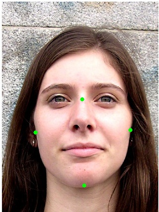
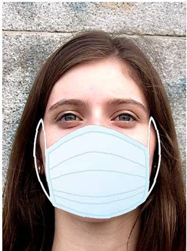
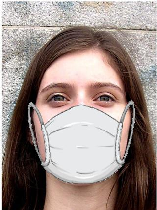
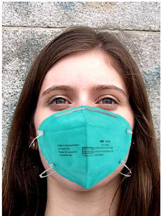
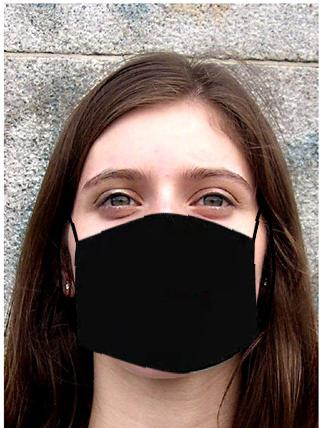
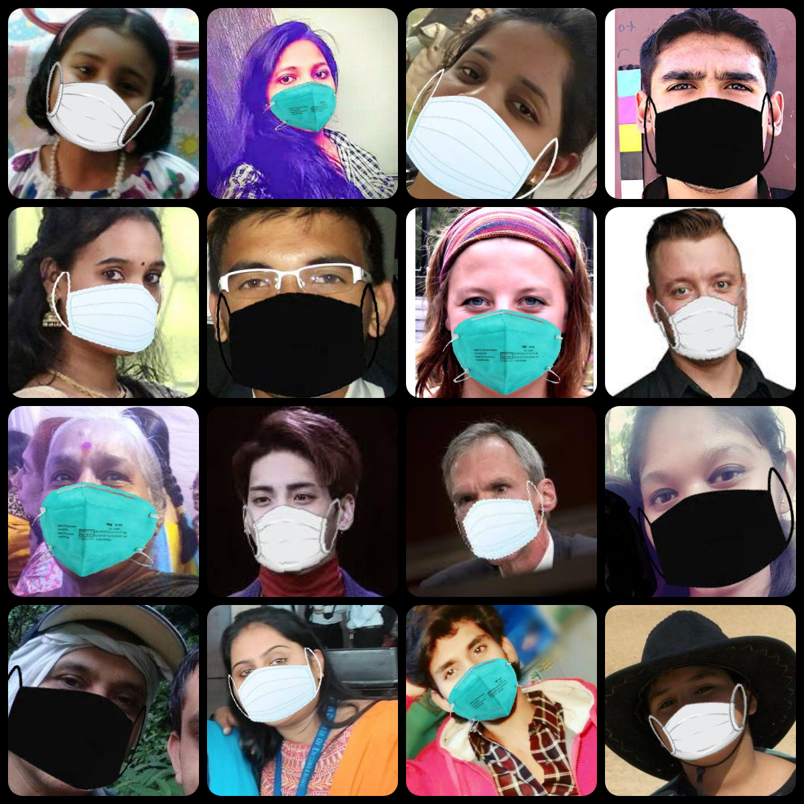
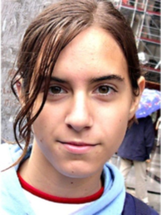
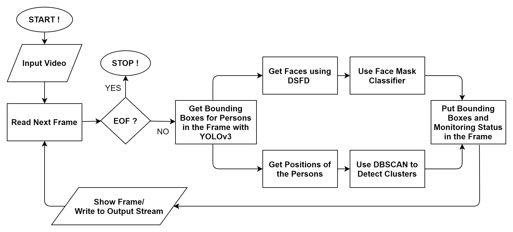

# Social Distancing with Artificial Intelligence
This project aims at monitoring people violating Social Distancing over video footage coming from CCTV Cameras. Uses YOLOv3 along with DBSCAN clustering for recognizing potential intruders. A Face Mask Classifier model (ResNet50) is trained and deployed for identifying people not wearing a face mask. For aiding the training process, augmented masked faces are generated (using facial landmarks) and blurring effects (frequently found in video frames) are also imitated.

A detailed description of this project along with the results can be found [here](#project-description-and-results).

## Getting Started

### Prerequisites
Running this project on your local system requires the following packages to be installed :

* numpy
* matplotlib
* sklearn
* PIL
* cv2
* keras 
* face_detection
* face_recognition
* tqdm

They can be installed from the Python Package Index using pip as follows :
 
     pip install numpy
     pip install matplotlib
     pip install sklearn
     pip install Pillow
     pip install opencv-python
     pip install Keras
     pip install git+https://github.com/hukkelas/DSFD-Pytorch-Inference.git
     pip install face-recognition
     pip install tqdm
     
You can also use [Google Colab](https://colab.research.google.com/) in a Web Browser with most of the libraries preinstalled.
 
### Usage
This project is implemented using interactive Jupyter Notebooks. You just need to open the notebook on your local system or on [Google Colab](https://colab.research.google.com/) and execute the code cells in sequential order. The function of each code cell is properly explained with the help of comments.

Please download the following files (from the given links) and place them in the Models folder in the root directory :
1. YOLOv3 weights : https://pjreddie.com/media/files/yolov3.weights
2. Face Mask Classifier ResNet50 Keras Model : https://drive.google.com/drive/folders/1jupSKiJ_ngJYQmXA4cpur_KZGgUud3dA?usp=sharing

Also before starting you need to make sure that the path to various files and folders in the notebook are updated according to your working environment. If you are using [Google Colab](https://colab.research.google.com/), then :
1. Mount Google Drive using : 

        from google.colab import drive
        drive.mount("drive")
        
2. Update file/folder locations as `"drive/path_to_file_or_folder"`.

## Tools Used
* [NumPy](https://numpy.org/) : Used for storing and manipulating high dimensional arrays.
* [Matplotlib](https://matplotlib.org/) : Used for plotting.
* [Scikit-Learn](https://scikit-learn.org/stable/) : Used for DBSCAN clustering.
* [PIL](https://pillow.readthedocs.io/en/stable/) : Used for manipulating images.
* [OpenCV](https://opencv.org/) : Used for manipulating images and video streams.
* [Keras](https://keras.io/) : Used for designing and training the Face_Mask_Classifier model.
* [face-detection](https://github.com/hukkelas/DSFD-Pytorch-Inference) : Used for detecting faces with Dual Shot Face Detector.
* [face-recognition](https://github.com/ageitgey/face_recognition) : Used for detecting facial landmarks.
* [tqdm](https://github.com/tqdm/tqdm) : Used for showing progress bars.
* [Google Colab](https://colab.research.google.com/) : Used as the developement environment for executing high-end computations on its backend GPUs/TPUs and for editing Jupyter Notebooks. 

## Contributing
You are welcome to contribute :

1. Fork it (https://github.com/rohanrao619/Social_Distancing_with_AI/fork)
2. Create new branch : `git checkout -b new_feature`
3. Commit your changes : `git commit -am 'Added new_feature'`
4. Push to the branch : `git push origin new_feature`
5. Submit a pull request !

## Future Work
* Speed Optimization
* Face Mask Classification for Side Views
* Better Social Distancing Detection

If you have any new ideas or suggestions to improve this project, feel free to contact me. Your valuable feedback is highly appreciated!

## License
This Project is licensed under the MIT License, see the [LICENSE](LICENSE) file for details.

## Project Description and Results
### Person Detection
[YOLO](https://pjreddie.com/darknet/yolo/) (You Only Look Once) is a state-of-the-art, real-time object detection system. It's Version 3 (pretrained on COCO dataset), with a resolution of 416x416 in used in this project for obtaining the bounding boxes of individual persons in a video frame. To obtain a faster processing speed, a resolution of 320x320 can be used (lowered accuracy). Similarly, a resolution of 512x512 or 608x608 can be used for an even better detection accuracy (lowered speed). You can change the resolution by modifying the `height` and `width` parameters in the yolov3.cfg file and in the blobFromImage function in the [Monitor Notebook](https://github.com/rohanrao619/Social_Distancing_with_AI/blob/master/Social_Distancing_Monitor.ipynb). YOLOv3-tiny can also be used for speed optimization. However it will result in a decreased detection accuracy.

### Face Detection
[Dual Shot Face Detector](https://github.com/Tencent/FaceDetection-DSFD) (DSFD) is used throughout the project for detecting faces. Common Face Detectors such as the Haar-Cascades or the MTCNN are not efficient in this particular use-case as they are not able to detect faces that are covered or have low-resolution. DSFD is also good in detecting faces in wide range of orientations. It is bit heavy on the pipeline, but produces accurate results.

### Face Mask Classifier
A slighly modified ResNet50 model (with base layers pretrained on imagenet) is used for classifying whether a face is masked properly or not. Combination of some AveragePooling2D and Dense (with dropout) layers ending with a Sigmoid or Softmax classifier is appended on top of the base layers. Different architectures can be used for the purpose, however complex ones should be avoided to reduce overfitting.

For this classifier to work properly in all conditions, we need a diverse dataset that contains faces in various orientations and lighting conditions. For better results, our dataset should also cover people of different ages and gender. Finding such wide range of pictures having people wearing a face mask becomes a challenging task. Thus we need to apply numerous kinds of Augmentation before we start the training process.

### Masked Face Augmentation
It may seem a little akward, but with the power of deep learning in our hands, impossible is nothing!

|||
|:---:|:---:|
|**Original**|**Facial Landmarks**|

The picture on the left is the original image and that on the right shows the points (green dots) that we need to artificially put a face mask on it. These points are found by doing some manipulation on facial landmarks, namely nose_bridge and chin. Top point is near the 1st and 2nd points in the detected nose_bridge points. Left, Right and Bottom points are near the first, last and middle points in the detected chin points respectively.

Now we just need to resize and rotate the image of mask according to these 4 reference points and paste it on the original one. Implementation details can be found in this [notebook](https://github.com/rohanrao619/Social_Distancing_with_AI/blob/master/Data_Augmentation.ipynb). Trying with different mask images we get this :

|||||
|:---:|:---:|:---:|:---:|
|**Default**|**White**|**Blue**|**Black**|

These augmented pics do not seem very real, but it is better having them rather than overfitting on a smaller dataset. We just need to take care that the original versions of these augmented samples do not appear in the training data, otherwise the model won't generalize well on new faces. This augmentation does not work very well for faces that are not fully visible or whose landmarks are not detected properly, but still manages to produce some decent results for various facial structures and orientations. Some other samples are shown below. 

### Blurring Augmentation
As we are working on video frames, it's highly probable we encounter blurred faces and it's damn sure DSFD won't miss any one of those! This Blurriness could be due to rapid movement, face being out of focus or random noise during capturing. So we need to randomly add some kind of blurring effect to some part of our training data. 3 types of effects are used :
1. Motion Blur (Mimics Rapid Movement)
2. Average Blur (Mimics Out of Focus)
3. Gaussian Blur (Mimics Random Noise)

Implementation details can be found in this [notebook](https://github.com/rohanrao619/Social_Distancing_with_AI/blob/master/Data_Augmentation.ipynb). An example of average and gaussian blur is shown below. A kernel of size (5,5) was used for the same.

||||
|:---:|:---:|:---:|
|**Original**|**Average Blur**|**Gaussian Blur**|

On the same picture, motion blur with a kernel of size (7,7), in the 4 principal directions looks something like this :

|||||
|:---:|:---:|:---:|:---:|
|**Horizontal**|**Vertical**|**Main Diagonal**|**Anti Diagonal**|

### Training 
It's training time! By using Keras' ImageDataGenerator we apply augmentation on the fly. Training data now keep changing after each epoch. Rotation, Horizontal Flip, Brightness Shift are some of augmentations that can be applied. We also incorporate our blurring augmentation with some associated probabilities during the training. Implementation details can be found in this [notebook](https://github.com/rohanrao619/Social_Distancing_with_AI/blob/master/Face_Mask_Classifier.ipynb). 

The model needs to be trained on tons of relevant data before we can apply it in real-time and expect it to work. It needs a lot of computational power and I mean a lot! We can try our models trained on a small dataset in our local machines, but it would not produce desirable results. We can use pretrained open-source models for now. So we use the model trained by the team of [Thang Pham](https://github.com/aome510/Mask-Classifier) for this purpose. It is basically a ResNet50 Model with a modified top.

### Pipeline

Implementation details can be found in this [notebook](https://github.com/rohanrao619/Social_Distancing_with_AI/blob/master/Social_Distancing_Monitor.ipynb). Some optimizations can be made in the form of vectorization. For getting the position of a person, there are various approaches. One of them being simply using the centers of the bounding boxes, the one used in this project. Other one is using OpenCV's perspective transform to get a bird's eye view of the positions, but that kind of needs pretty accurate frame of reference points. Using it also increases the complexity of the system by a bit. However if implemented correctly, it will no doubt produce better results. For now we stick to the first approach. Remember, there's always scope for improvements!

### Results

As we can see, the system identifies the people in the frame and their faces (if it is visible) and puts green or red bounding boxes if they are safe or not safe respectively. Status is shown in a bar at the top, showing all the details. These are pretty decent results considering the complexity of the problem we have at our hands. But we can't see if the Face Mask Classifier is working properly or not. Let's take a look at another example.

Yes! there we have it. It is producing very neat results, detecting masked faces properly. Keep in mind that while the social distancing is pretty decently detected in these samples (2nd Example), the system is not designed for these kind of clips, and might perform terribly sometimes (As people are in different scales and the 3rd dimension of depth is completely ignored). Obviously, a top view like from a CCTV Camera is more suitable for social distancing detection (As in the 1st Example).

These are just GIFs for embedding in this Readme, original full resolution video results can be seen [here](https://github.com/rohanrao619/Social_Distancing_with_AI/tree/master/Results).

Artificial Intelligence has sure come a long way in solving such real world problems. Hoping that it helps the world overcome the COVID-19 situation, so we can party again, hold our glasses high, and say Cheers!

## Final Notes
**Thanks for going through this Repository! Have a nice day.** 
 **Got any Queries? Feel free to contact me.** 
 **Saini Rohan Rao**

